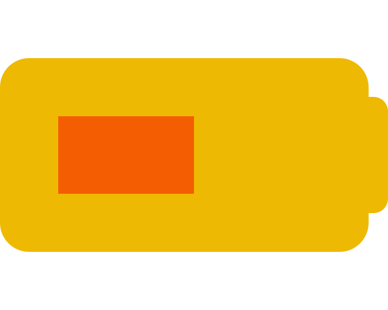
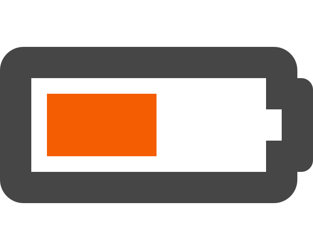

<div style="text-align: center">
  
</div>

This package allows you to color **individual pieces** of [Font Awesome](https://fontawesome.com) icons, using React.


It is basically the same as [@fortawesome/react-fontawesome](https://github.com/FortAwesome/react-fontawesome), except `<FontAwesomeIcon>` accepts a new prop `fill={['color1', 'color2', 'color3']}` to specify the colors of the different parts of the icon.

<a title="@ntag/react-fontawesome on npm" href="https://www.npmjs.com/package/@ntag/react-fontawesome">
  
</a>

# Installation
Install [React FontAwesome](https://fontawesome.com/how-to-use/on-the-web/using-with/react) as usual, except `@fortawesome/react-fontawesome` you replace by `@ntag/react-fontawesome`:
```
$ npm i --save @fortawesome/fontawesome-svg-core \
  npm i --save @fortawesome/free-solid-svg-icons \
  npm i --save @ntag/react-fontawesome
```

# Usage
In your main file (`index.js`, `App.js`):
```js
import { library } from '@fortawesome/fontawesome-svg-core';
import { faCloudSun } from '@fortawesome/free-solid-svg-icons';

library.add(faCloudSun);
```
In your component:
```js
import FontAwesomeIcon from '@ntag/react-fontawesome';

export const Weather = () => (
  <div>
    <h1>Weather</h1>
    <FontAwesomeIcon icon="cloud-sun" fill={['#3C6997', '#EDFF71', '#F1DB4B']} />
  </div>
);
```
`fill` accepts an array of CSS colors.
Use `currentColor` to use the text color.
The text color will also be used if the `fill` array is smaller than the number of pieces in the icon.

Finally, if you don't pass the `fill` property, `<FontAwesomeIcon>` will work exactly the same as the original one from [@fortawesome/react-fontawesome](https://github.com/FortAwesome/react-fontawesome).

Also, instead of using an array, you can also use multiple props: `fill0`, `fill1`, `fill2`, `fill3` to colors the parts 1, 2, 3 and 4 for example.

# How does it work?
Font Awesome icons are composed by a single `<path>` SVG element.


First, the path is split on `m` or `M` letters, indicating a movement of the pencil, to get multiple pieces.


We have multiple pieces but two problems: the paths are not correctly positionned, and the subtraction of shapes doesn't work anymore.
We start by recomputing the correct position of each piece.



It looks better.
However, the second piece should be subtracted to the first one, to create a hole.
Even if the two paths are drawn in opposite directions, the subtraction doesn't work because they are now in two different `<path>`.
We need to merge elements which work together.

To do that, the algorithm takes each path, computes if it intersects the previous one, and if that's the case, merge the two `<path>` together, so the subtraction works.
If that's not the case, it doesn't merge them and process the next path.


